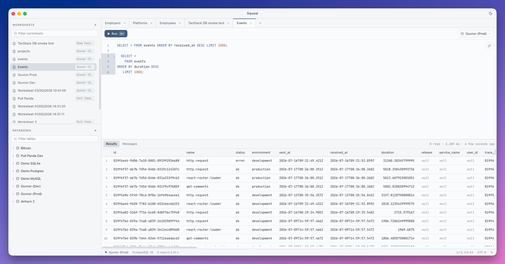

  

<h1 align="center">Squeal – A Delightful SQL Client</h1>

  

Squeal is a desktop SQL client built around what querying a database actually
looks like: a dozen half-finished statements you keep coming back to, one of
them you want to run right now, and a table of results you need to read without
squinting. It speaks PostgreSQL, MySQL, and SQLite.

Your SQL lives in worksheets instead of files you have to name and save. A
worksheet holds as many statements as you want, `Cmd+Enter` runs the one your
cursor is sitting in, and the results appear underneath. Everything is saved as
you type, so closing a tab is never a decision — and if a query turns out to be
a mistake, you can cancel it while it runs instead of waiting it out.
`Cmd+Shift+F` tidies up the statement you are on and `Cmd+Shift+L` switches
between light and dark.

The sidebar keeps your connections next to your worksheets, so you can dig
through a database's schemas and tables and jump to the SQL that reads them:
"Query Table" opens a fresh worksheet with the `SELECT` already written. Each
worksheet remembers which database it belongs to, and switching a query to a
different one is a menu away. Passwords are encrypted with your operating
system's keychain — the app asks first, and takes no for an answer.

- 🔌 PostgreSQL, MySQL, and SQLite, with as many saved connections as you need
- 📝 Worksheets that autosave, and run the single statement under your cursor
- ✨ Syntax highlighting, keyword completion, and one-shortcut formatting
- 🗂️ Schemas and tables in the sidebar, and a filter that searches every
  connection at once when you only half-remember the name
- 🌗 Light and dark themes
- 🔐 Passwords encrypted with the OS keychain, once you have said yes
- 🖥️ Native builds for macOS, Windows, and Linux

## Getting Started

Download the latest build for macOS, Windows, or Linux from the
[releases page](https://github.com/Artmann/squeal/releases). On macOS and
Windows it updates itself from there on. To run it from source instead, see
[CONTRIBUTING.md](CONTRIBUTING.md).

## License

The source code is licensed under the MIT License and is free to use and modify.

The prebuilt binaries are free for personal use. Commercial use requires an
additional license.
